# Viral Outbreak Early Warning System

<p align="center">


</p>

---

> **End-to-end machine learning pipeline for synthetic epidemiological surveillance and early outbreak prediction using spatio-temporal simulation, environmental variables and explainable AI.**

---

# Overview

Early detection of infectious disease outbreaks is essential for timely public health interventions.

However, real epidemiological datasets are often:

- confidential
- incomplete
- geographically restricted
- difficult to reproduce

This project addresses these limitations by building a **fully synthetic epidemiological surveillance system** capable of simulating realistic outbreak dynamics across multiple regions.

The generated dataset is then used to train machine learning models capable of predicting **viral outbreak risk seven days in advance**.

The entire pipeline is fully reproducible and includes:

- Synthetic epidemic simulation
- Feature engineering
- Machine learning
- Model evaluation
- Explainable AI
- Automated reporting
- Publication-style notebooks

---

# Project Highlights

- End-to-end epidemiological surveillance pipeline
- Synthetic spatio-temporal epidemic simulation
- Dynamic Rt modelling
- Spatial diffusion network
- Environmental and climate effects
- Mobility and vaccination modelling
- Healthcare pressure simulation
- Imported infection dynamics
- Temporal feature engineering
- Time-aware train/test split (prevents data leakage)
- Multiple machine learning algorithms
- Explainable AI using SHAP and permutation importance
- Automated evaluation reports
- Publication-style documentation

---

# Pipeline

```
Synthetic Epidemic Simulation
            │
            ▼
Synthetic Epidemiological Dataset
            │
            ▼
Feature Engineering
            │
            ▼
Machine Learning
            │
            ▼
Model Evaluation
            │
            ▼
Explainable AI
            │
            ▼
Visual Reports
            │
            ▼
Publication-style Notebooks
```

---

# Repository Structure

```
Viral-Outbreak-Early-Warning-System/

├── data/
│   ├── raw/
│   └── processed/
│
├── models/
│
├── notebooks/
│   ├── 01_data_generation.ipynb
│   ├── 02_exploratory_data_analysis.ipynb
│   ├── 03_model_training.ipynb
│   └── 04_model_explainability.ipynb
│
├── reports/
│   ├── figures/
│   └── tables/
│
├── src/
│   ├── simulate_data.py
│   ├── train_model.py
│   ├── evaluate_model.py
│   ├── visualize_results.py
│   └── explainability.py
│
├── requirements.txt
├── README.md
└── LICENSE
```

---

# Synthetic Dataset

The simulation generates a daily regional epidemiological dataset including more than thirty variables describing disease transmission, mobility, environmental conditions and healthcare system dynamics.

## Epidemiological Variables

- Reported cases
- True infections
- Effective reproduction number (Rt)
- Effective transmission rate
- Spatial infection pressure
- Imported infections
- Incidence per 100,000 inhabitants

## Environmental Variables

- Temperature
- Humidity
- Rainfall

## Population Variables

- Population
- Population density

## Healthcare Variables

- Healthcare capacity
- Healthcare pressure
- Testing rate

## Mobility Variables

- Mobility index
- Vaccination rate
- Public health intervention status

## Temporal Features

- Lagged cases
- Rolling averages
- Rolling standard deviations
- Growth rates

## Prediction Target

```
outbreak_7d
```

Binary classification indicating whether the region is expected to experience an outbreak within the next seven days.

---

# Machine Learning

Three supervised learning algorithms are evaluated.

| Model | Purpose |
|--------|---------|
| Logistic Regression | Baseline interpretable model |
| Random Forest | Non-linear ensemble |
| Gradient Boosting | Sequential boosting model |

The best-performing model is automatically saved for downstream analysis.

---

# Model Evaluation

To better reproduce real epidemiological forecasting, the project uses a **temporal train/test split** instead of a random split.

This prevents future observations from leaking into the training dataset.

Performance is evaluated using:

- Accuracy
- Precision
- Recall
- F1-score
- ROC AUC
- Precision-Recall AUC

---

# Model Performance

| Model | ROC AUC | PR AUC | Recall | F1-score |
|--------|--------:|--------:|--------:|--------:|
| Logistic Regression | 0.668 | 0.761 | 0.642 | 0.690 |
| Random Forest | 0.661 | 0.760 | 0.698 | 0.713 |
| Gradient Boosting | 0.630 | 0.722 | **0.910** | **0.777** |

The Gradient Boosting model achieved the highest recall, making it particularly suitable for an early warning scenario where detecting potential outbreaks is generally more important than minimizing false positives.

---

# Evaluation Outputs

Running the evaluation pipeline automatically generates:

```
reports/tables/

model_performance_metrics.csv

classification_reports.json

final_model_metrics.csv

final_classification_report.csv

final_confusion_matrix.csv

threshold_analysis.csv

evaluation_metadata.json

test_set_predictions.csv

```

---# Explainable AI

Predictive performance alone is not sufficient in healthcare applications.

For this reason, the project includes several explainability techniques to better understand how the trained models make predictions.

The explainability pipeline includes:

- Permutation Importance
- Model-based Feature Importance (when supported)
- SHAP Summary Analysis
- Threshold Sensitivity Analysis

These methods help identify the variables that contribute most strongly to predicted outbreak risk.

---

# Generated Figures

The pipeline automatically generates publication-quality figures.

## Epidemiological Simulation

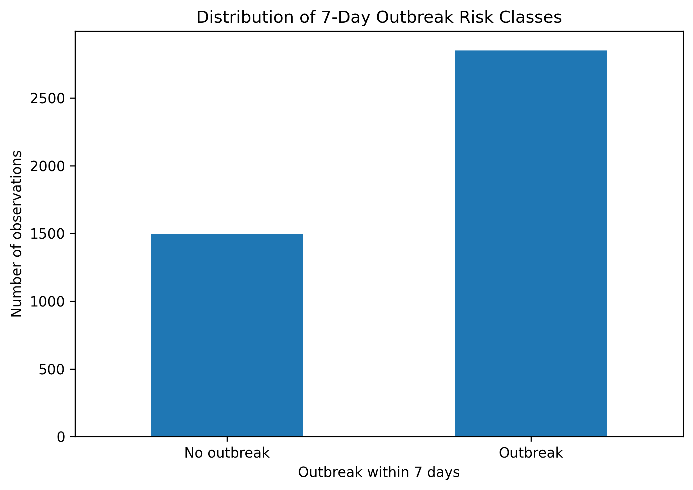

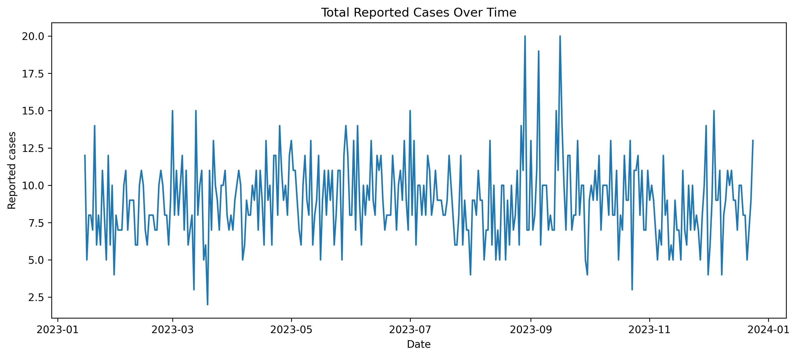

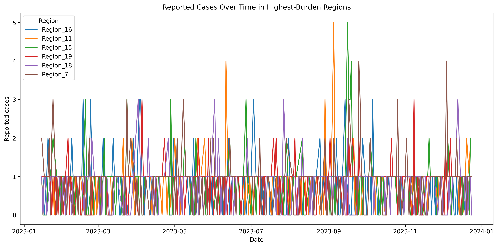

---

## Exploratory Data Analysis

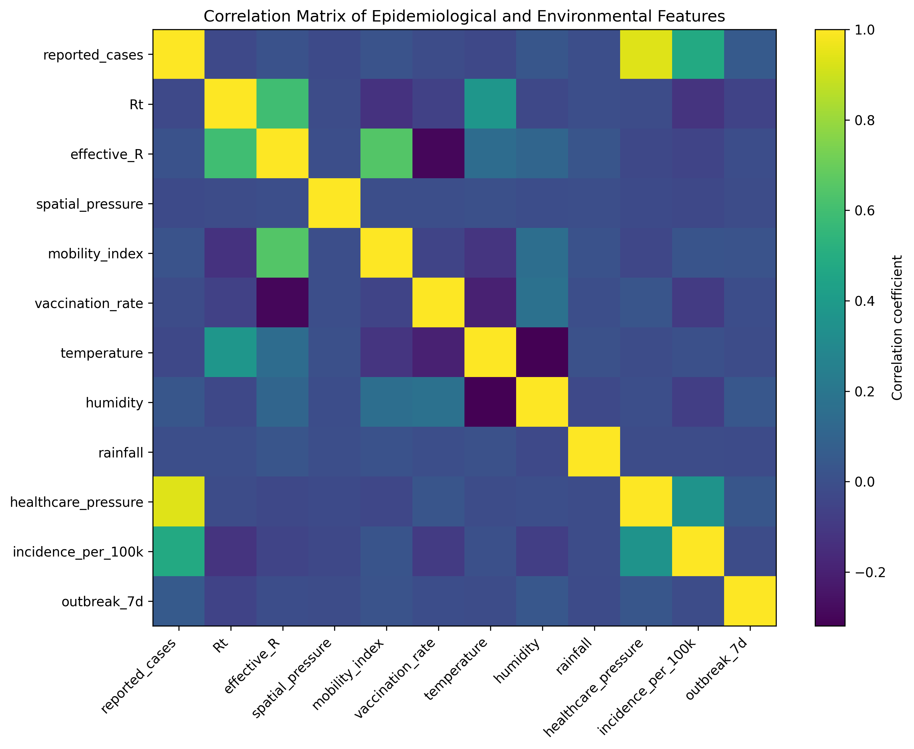

---

## Machine Learning Performance

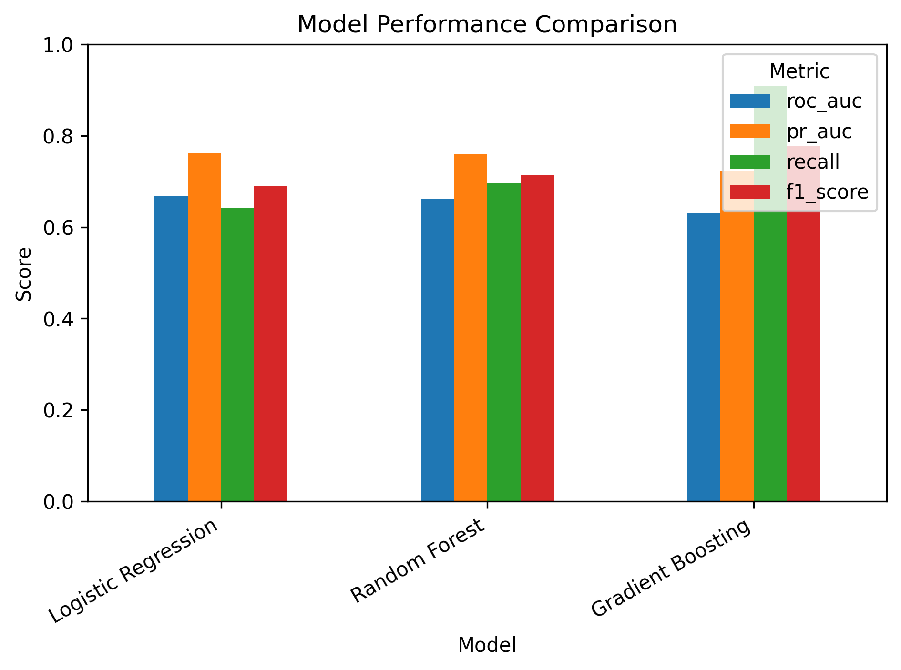

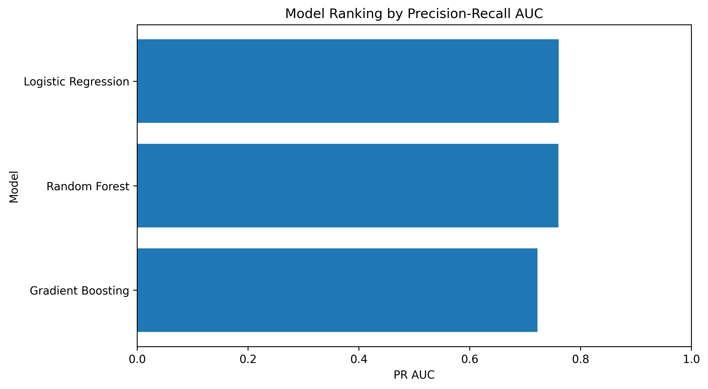

---

## Final Model Evaluation

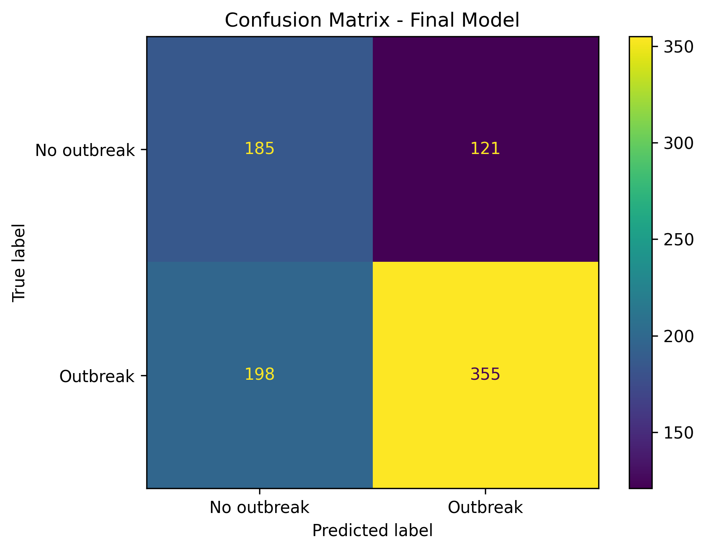

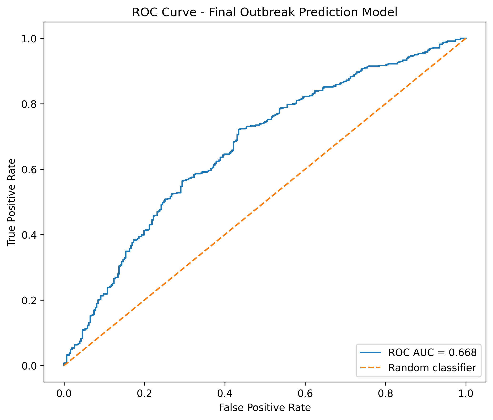

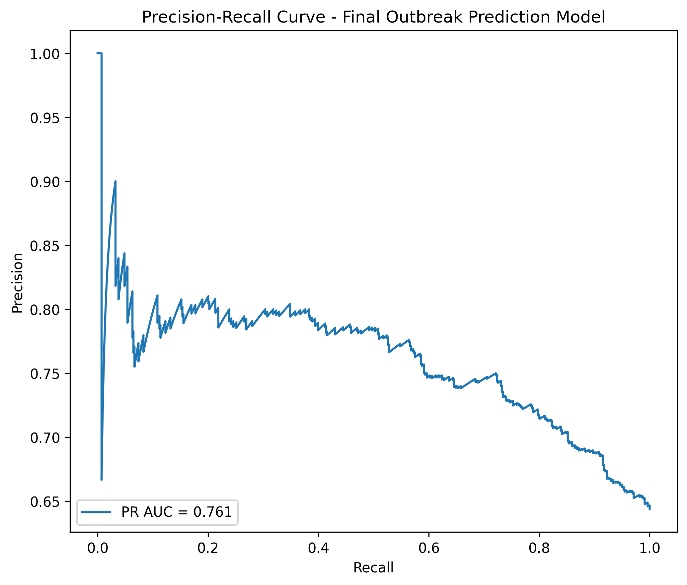

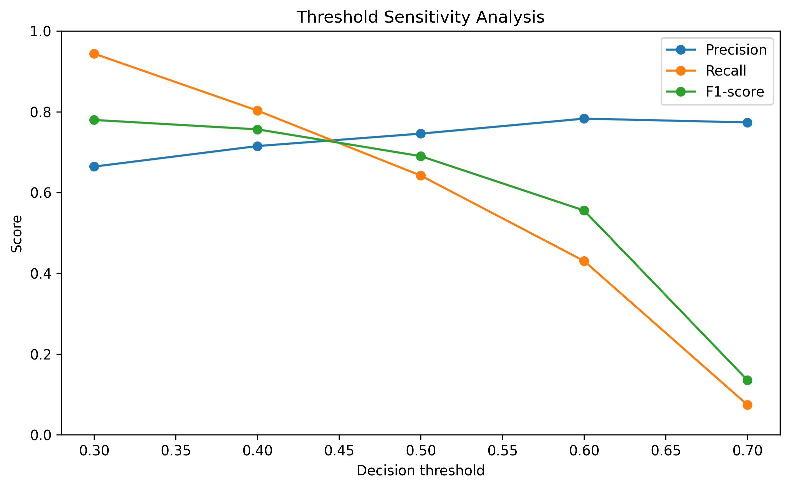

---

## Explainability

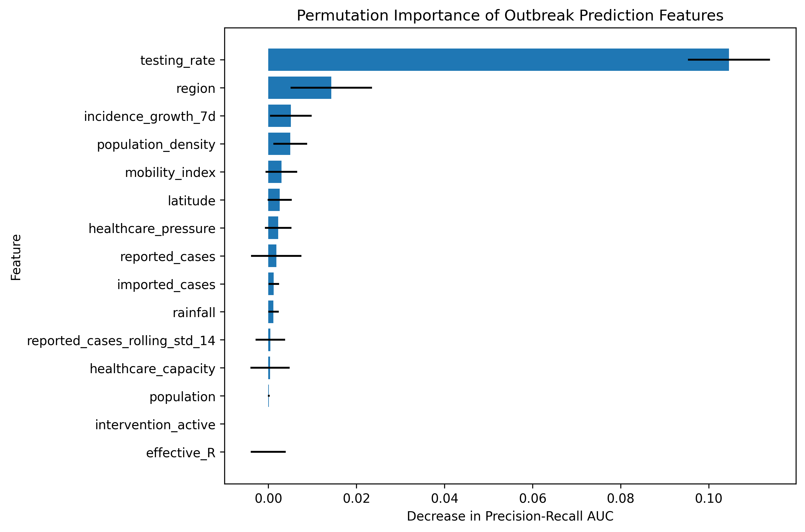


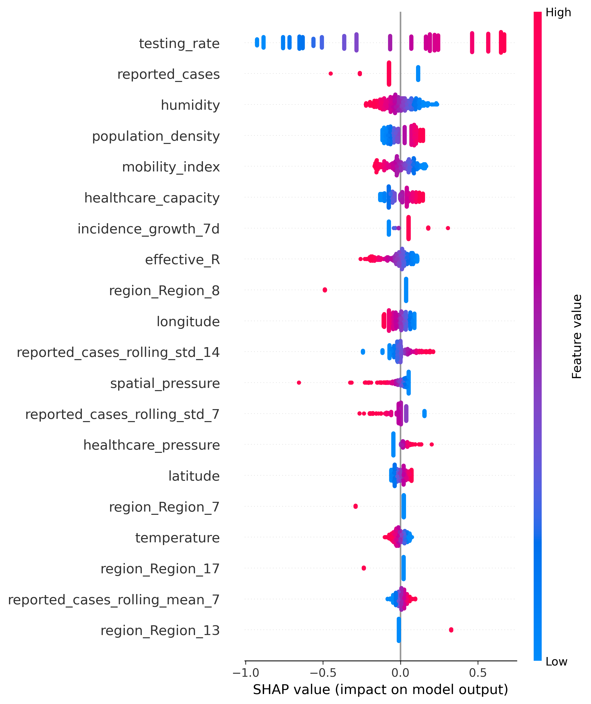

---

# Publication-Style Notebooks

The repository includes four notebooks documenting every stage of the project.

| Notebook | Description |
|----------|-------------|
| 01_data_generation.ipynb | Synthetic epidemiological simulation |
| 02_exploratory_data_analysis.ipynb | Exploratory data analysis |
| 03_model_training.ipynb | Machine learning training and comparison |
| 04_model_explainability.ipynb | Explainability and SHAP analysis |

These notebooks are intended to provide a paper-style narrative describing both the methodology and the results.

---

# Installation

Clone the repository:

```bash
git clone https://github.com/YOUR_USERNAME/Viral-Outbreak-Early-Warning-System.git
```

Move into the project directory:

```bash
cd Viral-Outbreak-Early-Warning-System
```

Install dependencies:

```bash
pip install -r requirements.txt
```

---

# Running the Complete Pipeline

Generate the synthetic dataset:

```bash
python src/simulate_data.py
```

Train the machine learning models:

```bash
python src/train_model.py
```

Evaluate the best model:

```bash
python src/evaluate_model.py
```

Generate visualizations:

```bash
python src/visualize_results.py
```

Run explainability analysis:

```bash
python src/explainability.py
```

---

# Technologies

- Python
- Pandas
- NumPy
- Scikit-learn
- Matplotlib
- SHAP
- Git
- GitHub

---

# Potential Applications

Although this project uses synthetic data, the methodology can be adapted to:

- Infectious disease surveillance
- Hospital resource planning
- Public health decision support
- Healthcare analytics
- Epidemiological forecasting
- Early warning systems

---

# Future Improvements

Possible future extensions include:

- XGBoost
- LightGBM
- CatBoost
- Graph Neural Networks
- Bayesian epidemiological models
- Real-world epidemiological datasets
- Docker deployment
- CI/CD with GitHub Actions
- Streamlit dashboard
- Azure Machine Learning deployment
- MLflow experiment tracking
- Hyperparameter optimization with Optuna

---

# Project Limitations

This project has several important limitations.

- The dataset is entirely synthetic.
- Disease transmission dynamics are simplified compared with real epidemiological processes.
- Model performance depends on the assumptions used during simulation.
- Explainability methods identify statistical associations rather than causal relationships.
- The models have not been validated using real-world surveillance datasets.

These limitations are acknowledged to encourage transparent interpretation of the results.

---

# Disclaimer

This repository is intended for educational and research purposes only.

The generated dataset does **not** represent real patients, real outbreaks or real public health events.

The project should not be used for clinical or public health decision-making without appropriate validation using real epidemiological data.

---

# About the Author

**David Lafuente Pérez**

BSc Biotechnology • MSc Virology

Interested in:

- Data Science
- Machine Learning
- Healthcare Analytics
- Epidemiology
- Bioinformatics
- Artificial Intelligence

---

## Contact

If you have suggestions, questions or would like to collaborate, feel free to open an Issue or submit a Pull Request.

If you found this project interesting, consider giving the repository a ⭐.
